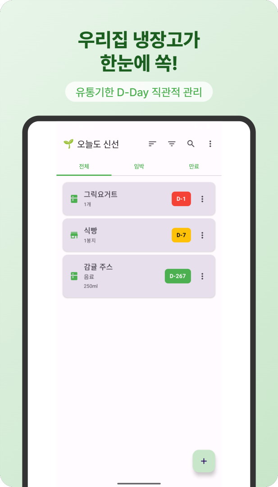
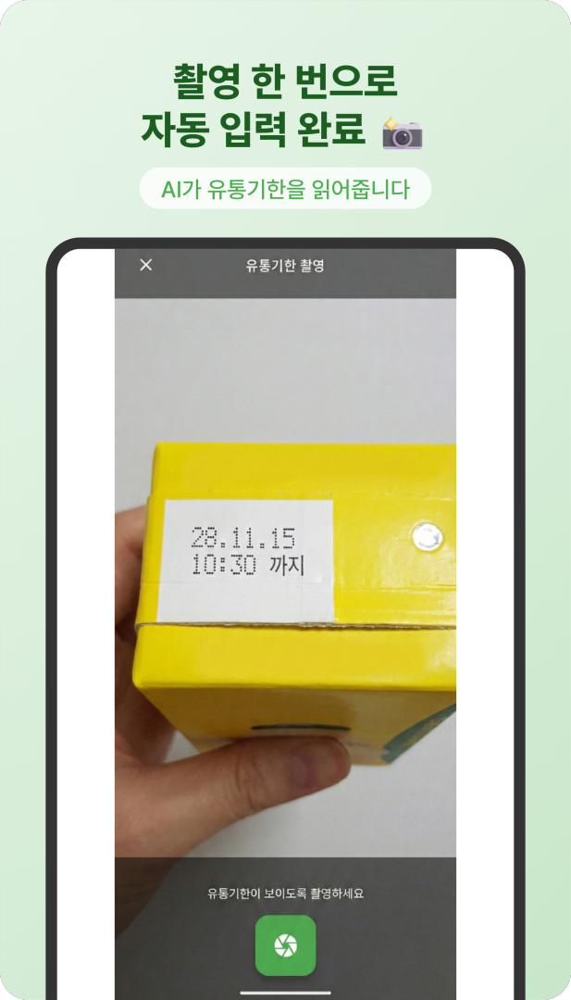
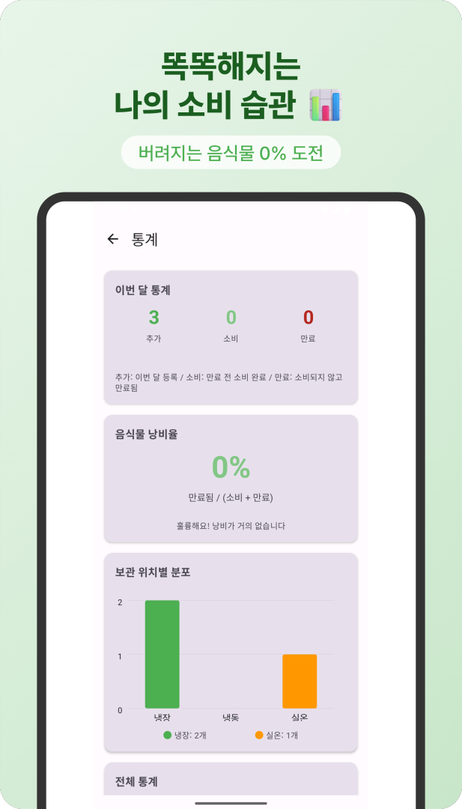

# 오늘도 신선 (Fridge D-Day)

식품의 유통기한을 촬영해 등록하고, 만료 임박 알림과 소비 통계를 제공하는 **오프라인 우선 Android 앱**입니다. Kotlin·Jetpack Compose를 처음부터 적용해 기획, 구현, 테스트, 스토어 등록까지 단독으로 진행했습니다.

[원스토어에서 보기](https://m.onestore.co.kr/v2/ko-kr/app/0001003331)

<p align="center">
  
  
  
</p>

## 해결하려던 문제

유통기한 관리 앱은 날짜를 일일이 입력해야 하면 금방 사용을 중단하게 됩니다. 반대로 계정과 서버를 사용하면 식품·소비 기록이 외부로 전송될 수 있습니다. 오늘도 신선은 **촬영으로 입력 부담을 줄이고, 데이터를 기기 안에만 저장하는 것**을 핵심 기준으로 삼았습니다.

## 핵심 기능

- **OCR 날짜 입력**: CameraX로 촬영한 이미지를 ML Kit 한국어 OCR로 읽고 날짜 후보 추출
- **유통기한 관리**: Room DB에 식품명·보관 위치·만료일 저장, D-Day 상태 표시
- **백그라운드 알림**: WorkManager로 만료 임박 항목 확인 및 알림
- **소비 통계**: 추가·소비·만료 기록과 보관 위치별 분포 표시
- **홈 화면 위젯**: 오늘·내일 만료되는 항목을 앱 실행 없이 확인
- **백업·복원**: JSON 파일로 로컬 데이터 내보내기와 가져오기
- **다크 모드**: Material Design 3 테마 적용

## 설계 판단

### 서버 없는 오프라인 구조

앱에는 `INTERNET` 권한이 없고 필요한 권한은 카메라와 알림뿐입니다. 데이터는 Room DB와 DataStore에 저장되며 광고·분석 SDK나 계정 기능을 넣지 않았습니다.

### MVVM + Repository

UI, 상태 관리, 데이터 접근을 분리해 화면 로직이 Room 구현에 직접 의존하지 않도록 구성했습니다.

```text
Jetpack Compose UI
        ↓
ViewModel + StateFlow
        ↓
Repository
        ↓
Room DB / DataStore
```

### OCR 실패를 고려한 입력 흐름

OCR은 조명과 라벨 방향에 따라 결과가 달라질 수 있습니다. 촬영 이미지를 0도와 90도로 각각 분석하고, 인식하지 못한 경우 사용자가 날짜를 직접 수정할 수 있도록 했습니다.

## 기술 스택

| 영역 | 기술 |
|---|---|
| 언어·UI | Kotlin, Jetpack Compose, Material Design 3 |
| 상태·구조 | ViewModel, StateFlow, MVVM, Repository |
| 데이터 | Room, DataStore, Gson |
| 백그라운드 | WorkManager, Android Notification |
| 카메라·OCR | CameraX, Google ML Kit Text Recognition |
| 부가 기능 | Glance App Widget, 로컬 JSON 백업·복원 |

## 검증 가능한 결과

- 원스토어 앱 출시
- 네트워크 권한 없이 온디바이스 데이터 처리
- `DateUtils`, `DDayState` 단위 테스트
- Room DAO 및 홈 화면 계측 테스트
- Android 의존성과 분리한 OCR 날짜 파서 단위 테스트 및 GitHub Actions 품질 게이트
- Target SDK 35, ProGuard 적용

OCR 정확도는 아직 성과 수치로 주장하지 않습니다. 동일한 사진 표본으로 버전 간 품질을 비교할 수 있도록 [OCR 벤치마크 기준](docs/qa/OCR_BENCHMARK.md)과 기록 스키마를 마련했습니다.

## 프로젝트 구조

```text
app/src/main/java/app/fridgedday/
├─ data/       Room, DAO, Entity, Repository, DataStore
├─ ui/         Compose 화면과 ViewModel
├─ util/       날짜 계산, OCR, 알림, 백업·복원
├─ worker/     WorkManager 만료 확인
└─ widget/     홈 화면 위젯
```

## 실행

요구사항:

- Android Studio
- JDK 17
- Android SDK 35

```bash
git clone https://github.com/crushonyou2/Fridge-D-Day.git
cd Fridge-D-Day
./gradlew assembleDebug
```

## 한계와 다음 과제

- OCR 정확도는 라벨 품질과 촬영 환경에 영향을 받으며 별도 정량 평가셋은 아직 없습니다.
- 가족 공유나 클라우드 동기화는 프라이버시 우선 범위에서 제외했습니다.
- 현재 공개 배포 채널은 원스토어이며 Google Play에는 출시하지 않았습니다.

## 개발자

**Jigwan Joe — Solo Android Developer**

- GitHub: https://github.com/crushonyou2
- Email: jigwan.joe@gmail.com
